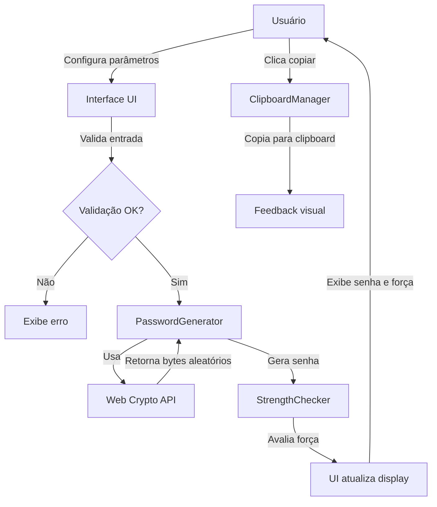
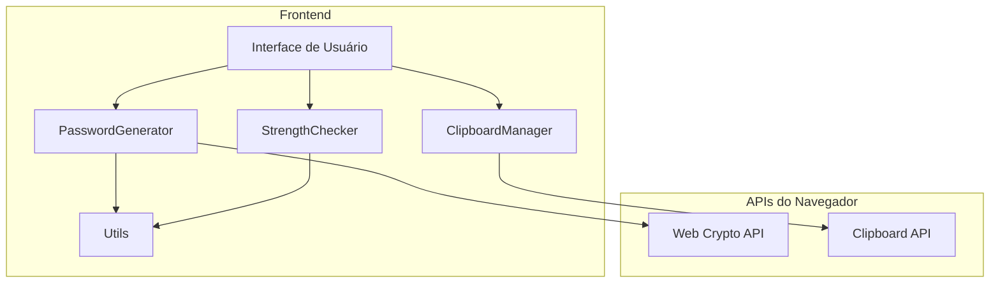
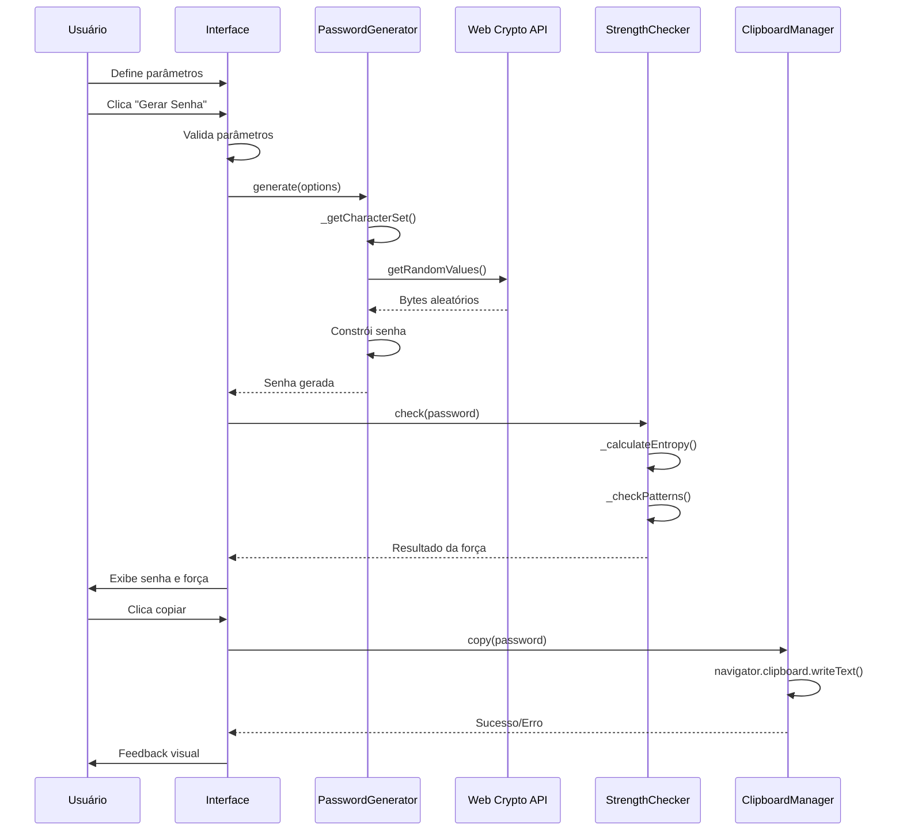

# Arquitetura - Gerador de Senhas Seguras

## Visão Geral

Este documento descreve a arquitetura de uma ferramenta web para geração de senhas seguras, utilizando tecnologias modernas e práticas recomendadas de segurança.

## Estrutura de Arquivos e Pastas

```
passwords-generator/
├── index.html              # Página principal da aplicação
├── README.md              # Documentação do projeto
├── ARCHITECTURE.md        # Este arquivo
├── assets/
│   ├── css/
│   │   ├── styles.css     # Estilos principais
│   │   └── components.css # Estilos dos componentes
│   ├── js/
│   │   ├── app.js         # Lógica principal da aplicação
│   │   ├── password-generator.js  # Módulo de geração de senhas
│   │   ├── strength-checker.js   # Módulo de avaliação de força
│   │   ├── clipboard.js   # Módulo de cópia para clipboard
│   │   └── utils.js       # Funções utilitárias
│   └── icons/
│       └── favicon.ico    # Ícone da aplicação
└── tests/
    ├── generator.test.js  # Testes do gerador
    └── strength.test.js   # Testes do avaliador de força
```

## Tecnologias Utilizadas

### Frontend
- **HTML5**: Estrutura semântica e acessível
- **CSS3**: Estilização responsiva com CSS Grid e Flexbox
- **JavaScript (ES6+)**: Lógica da aplicação com módulos nativos
- **Web Crypto API**: Geração criptograficamente segura de números aleatórios

### Ferramentas de Desenvolvimento
- **Git**: Controle de versão
- **ESLint**: Linting de código JavaScript
- **Prettier**: Formatação de código

## Componentes Principais

### 1. Gerador de Senhas (PasswordGenerator)
**Responsabilidades:**
- Gerar senhas aleatórias baseadas nos parâmetros configurados
- Utilizar Web Crypto API para garantir aleatoriedade criptográfica
- Gerenciar conjuntos de caracteres disponíveis
- Aplicar filtros de exclusão (caracteres similares)

**Interface:**
```javascript
class PasswordGenerator {
  constructor(options) {
    this.length = options.length || 16;
    this.includeUppercase = options.includeUppercase || true;
    this.includeLowercase = options.includeLowercase || true;
    this.includeNumbers = options.includeNumbers || true;
    this.includeSymbols = options.includeSymbols || true;
    this.excludeSimilar = options.excludeSimilar || false;
  }
  
  generate() { /* ... */ }
  generateMultiple(count) { /* ... */ }
  _getCharacterSet() { /* ... */ }
  _getSecureRandomInt(max) { /* ... */ }
}
```

### 2. Avaliador de Força (StrengthChecker)
**Responsabilidades:**
- Analisar a força da senha gerada
- Calcular entropia
- Fornecer feedback visual e textual
- Sugerir melhorias

**Interface:**
```javascript
class StrengthChecker {
  check(password) {
    return {
      score: 0-100,
      level: 'weak' | 'medium' | 'strong' | 'very-strong',
      feedback: [],
      entropy: number
    };
  }
  
  _calculateEntropy(password) { /* ... */ }
  _checkPatterns(password) { /* ... */ }
}
```

### 3. Gerenciador de Clipboard (ClipboardManager)
**Responsabilidades:**
- Copiar senha para área de transferência
- Fornecer feedback visual de sucesso/erro
- Gerenciar permissões do navegador

**Interface:**
```javascript
class ClipboardManager {
  async copy(text) { /* ... */ }
  _showFeedback(success) { /* ... */ }
}
```

### 4. Interface de Usuário (UI)
**Responsabilidades:**
- Renderizar controles interativos
- Gerenciar estado da aplicação
- Atualizar visualização em tempo real
- Validar entrada do usuário

## Fluxo de Dados



## Diagrama de Componentes



## Diagrama de Sequência - Geração de Senha



## Interface de Usuário Proposta

### Layout Principal
```
┌─────────────────────────────────────────┐
│         Gerador de Senhas Seguras       │
├─────────────────────────────────────────┤
│                                         │
│  Comprimento: [====|====] 16           │
│                                         │
│  □ Maiúsculas (A-Z)                    │
│  □ Minúsculas (a-z)                    │
│  □ Números (0-9)                       │
│  □ Símbolos (!@#$%...)                 │
│  □ Excluir caracteres similares        │
│                                         │
│  Quantidade: [1] senhas                 │
│                                         │
│  [      Gerar Senha      ]              │
│                                         │
├─────────────────────────────────────────┤
│  Senha gerada:                          │
│  ┌───────────────────────────────────┐ │
│  │ Xk9#mP2$nQ4!zR7&              📋 │ │
│  └───────────────────────────────────┘ │
│                                         │
│  Força: ████████░░ Forte (80/100)      │
│  Entropia: 95 bits                      │
│                                         │
└─────────────────────────────────────────┘
```

### Elementos Interativos
1. **Slider de Comprimento**: Range de 8 a 128 caracteres
2. **Checkboxes de Opções**: Seleção de tipos de caracteres
3. **Campo Numérico**: Quantidade de senhas (1-10)
4. **Botão Gerar**: Ação principal destacada
5. **Área de Resultado**: Exibição da senha com botão de cópia
6. **Indicador de Força**: Barra de progresso colorida

## Considerações de Segurança

### 1. Geração Criptográfica
- Uso exclusivo de `crypto.getRandomValues()` da Web Crypto API
- Nunca usar `Math.random()` para geração de senhas
- Garantir distribuição uniforme de caracteres

### 2. Manipulação de Dados
- Não armazenar senhas geradas no localStorage
- Limpar senhas da memória após uso
- Não enviar senhas para servidores externos

### 3. Interface Segura
- Implementar Content Security Policy (CSP)
- Evitar inline JavaScript
- Sanitizar todas as entradas do usuário

### 4. Práticas de Desenvolvimento
```javascript
// Exemplo de geração segura
function getSecureRandomInt(max) {
  const randomBuffer = new Uint32Array(1);
  crypto.getRandomValues(randomBuffer);
  return randomBuffer[0] % max;
}
```

## Padrões de Código

### JavaScript
- Usar classes ES6 para componentes
- Módulos ES6 para organização
- Async/await para operações assíncronas
- JSDoc para documentação

### CSS
- Metodologia BEM para nomenclatura
- Variáveis CSS para temas
- Mobile-first approach
- Suporte a dark mode

### HTML
- Semântica HTML5
- Atributos ARIA para acessibilidade
- Formulários acessíveis
- Labels descritivos

## Métricas de Qualidade

1. **Performance**
   - Tempo de geração < 100ms
   - First Contentful Paint < 1s
   - Tamanho total < 50KB

2. **Acessibilidade**
   - Score WCAG AA
   - Navegação por teclado
   - Screen reader friendly

3. **Segurança**
   - 100% cobertura de testes para geração
   - Auditoria de segurança regular
   - Sem dependências externas críticas

## Roadmap Futuro

1. **Fase 1 - MVP**
   - Funcionalidades básicas de geração
   - Interface responsiva
   - Cópia para clipboard

2. **Fase 2 - Melhorias**
   - Avaliação de força avançada
   - Histórico temporário (sessão)
   - Exportação de senhas

3. **Fase 3 - Recursos Avançados**
   - PWA (Progressive Web App)
   - Temas customizáveis
   - Integração com gerenciadores de senha